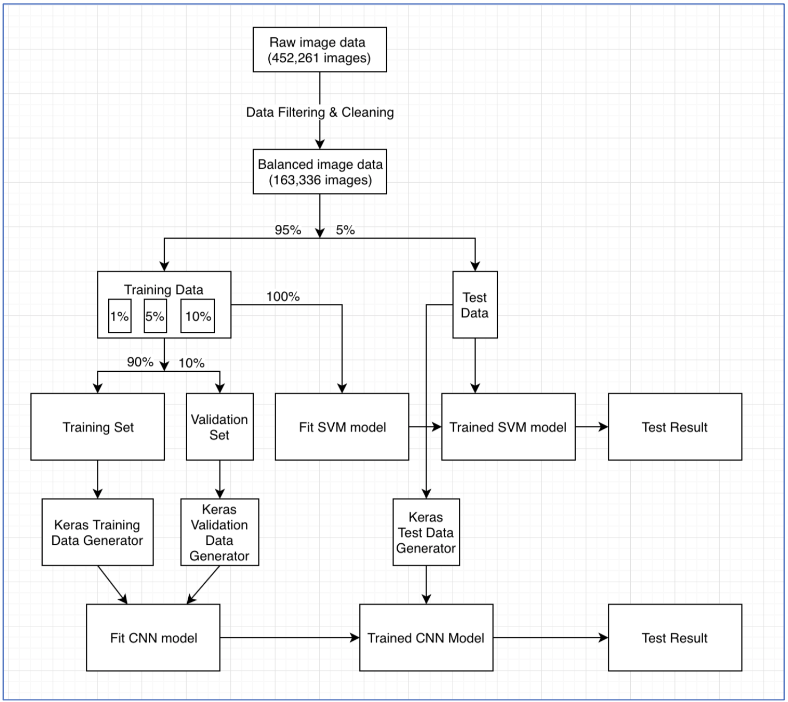
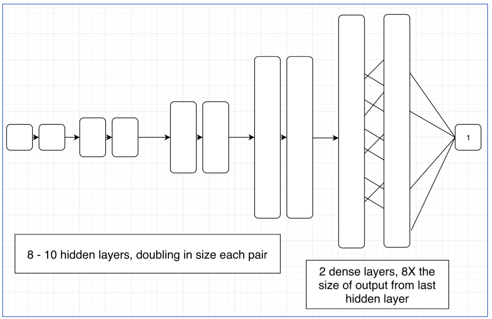
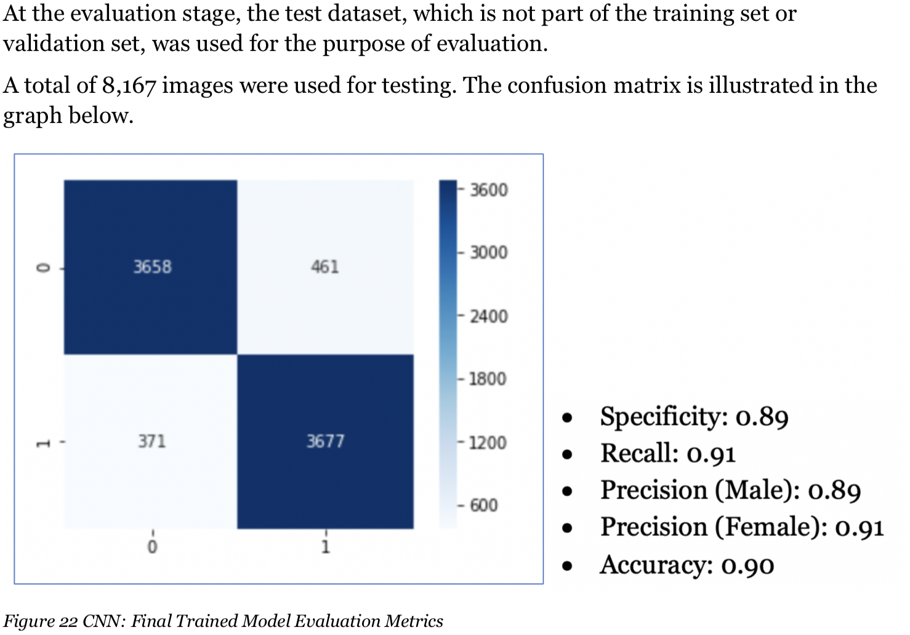
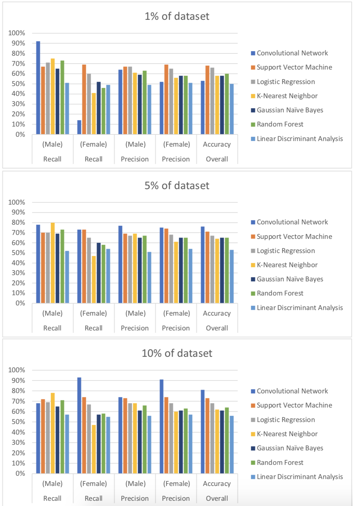
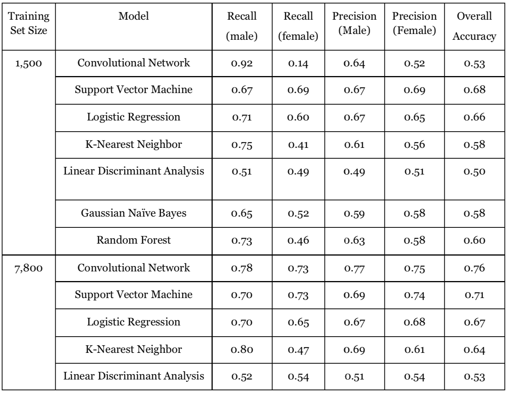
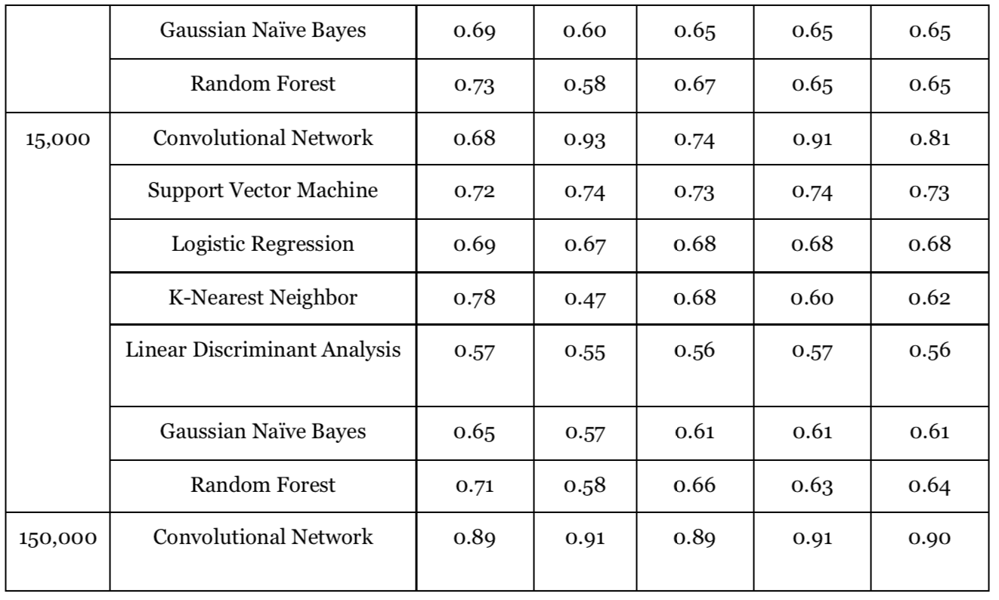
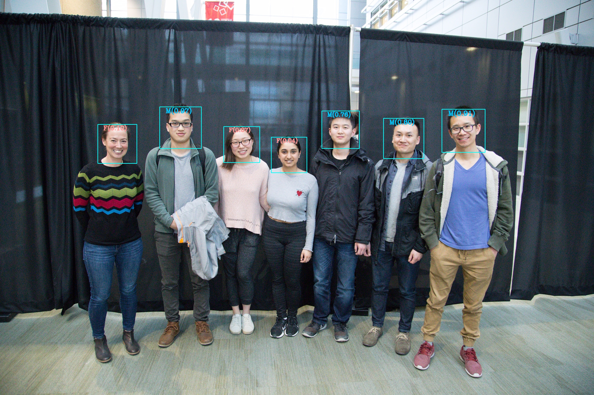

# Comparison of Image-based Gender Classification
### Data Preparation

### Final Construction of Convolutional Neural Network (CNN)
In the final design we used 10 hidden layers.

### Evaluation of Final CNN Model

### Comparison with Traditional ML Techniques

### Comparison of Models Trained on Different Dataset Sizes

### Implementation

